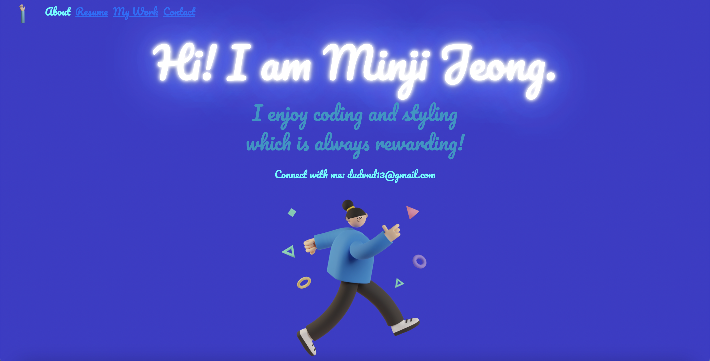

# minji-jeong-portfolio

My personal portfolio includes home, resume, my work, and contact page.
The goal was to create a website with well formatted that is mobile friendly, nice and clean look, brings to right directory, and provides all the information that is necessary. It introduces my education background, skills, and contact info.

[Click here to go to the website] (https://minji-jeong-portfolio.netlify.app)

## Technologies used

* CSS
* JavaScript
* HTML
* git

## Credits
* Figma - used 'Saly - 3D Illustration Pack' images
* Bootstrap

## Recent Changes

* Format my website properly/mobile friendly
* Styling my website to make it more cool and pretty
* Added functionalities for javascript

## Ice Box

- [ ] My project display icons about all the skills used in that project
- [x] Font design
- [ ] Light/Dark mode
- [ ] Have a 'Connect with me' page
- [ ] Sound
- [x] Add functionality using 'click' functions
- [x] Link any directories to the right path

